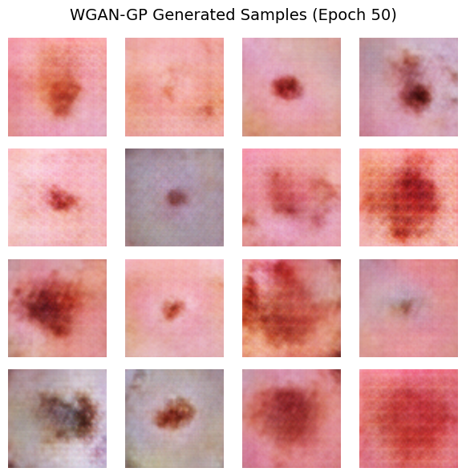

# GAN Benchmark on DermMNIST 🧬

This project benchmarks three GAN architectures — **LS-GAN**, **WGAN**, and **WGAN-GP** — for generating realistic skin lesion images using the **DermMNIST** dataset (RGB).

---

## 🎯 Objective

To evaluate and compare different GAN variants for generating synthetic medical images that can be used for data augmentation or visual analysis in dermatology-related AI.

---

## 🧬 Dataset

- **Source**: [MedMNIST – DermMNIST](https://medmnist.com/)
- **Classes**: 7 types of skin lesions
- **Image Format**: RGB, resized to 64x64
- **Local Path Used**:C:\Users\laksh\Downloads\dermamnist_224.npz

---

## 🧠 Models Compared

| Model      | Description                              |
|------------|------------------------------------------|
| LS-GAN     | Least Squares GAN using L2 loss          |
| WGAN       | Wasserstein GAN with weight clipping     |
| WGAN-GP    | Wasserstein GAN with Gradient Penalty ✅ |

---

## 📈 Evaluation Metrics

- **FID (Fréchet Inception Distance)** → Measures realism
- **IS (Inception Score)** → Measures diversity

---

## 📊 Final Results

| Model      | FID ↓      | IS ↑      | Verdict                  |
|------------|------------|-----------|---------------------------|
| LS-GAN     | 0.1656     | 1.0000    | Basic, blurry             |
| WGAN       | 0.0957     | 1.0000    | Textured, more stable     |
| **WGAN-GP**| **0.0278** | **1.0001**| ✅ Best quality and stability |

---

## 🖼️ Sample Output

<i>WGAN-GP Generated Samples – Epoch 50</i>

---

